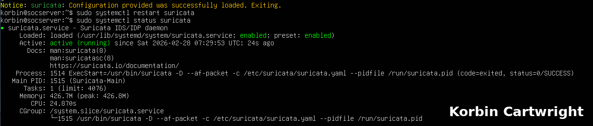
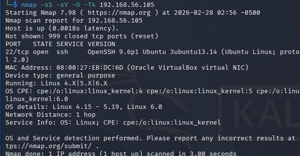
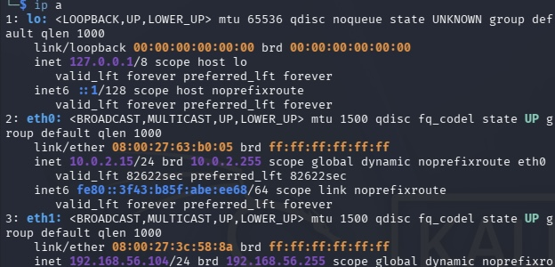
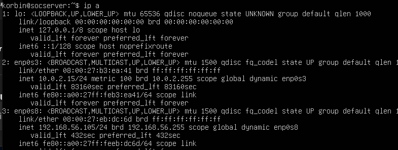

---

# 🛡️ Home SOC Lab – Live Intrusion Detection Project

## Overview

This project documents the design and deployment of a virtualized Security Operations Center (SOC) lab using VirtualBox.

The objective was to simulate attacker reconnaissance activity from Kali Linux and validate real-time detection using Suricata IDS running on an Ubuntu SOC server.

This lab demonstrates:

* Network segmentation
* IDS configuration and validation
* Active reconnaissance testing
* Log-based alert verification
* Documentation suitable for portfolio presentation

---

## Lab Architecture

### Virtual Machines

**Attacker**

* Kali Linux
* Dual network adapters

  * NAT for internet access
  * Host-only (192.168.56.0/24) for lab traffic

**SOC Server**

* Ubuntu Linux
* Suricata 7.x IDS
* Dual network adapters

  * NAT for updates
  * Host-only (192.168.56.105) for monitored traffic

---

## Network Segmentation

Both systems were configured with two interfaces:

| Machine | NAT Interface | Host-Only Interface |
| ------- | ------------- | ------------------- |
| Kali    | 10.0.2.15     | 192.168.56.104      |
| SOC     | 10.0.2.15     | 192.168.56.105      |

Suricata was bound to the host-only interface to monitor internal attack traffic without interfering with internet connectivity.

This separation mirrors real-world SOC sensor deployment where monitoring occurs on an internal network segment.

---

## IDS Configuration

Suricata was configured in IDS mode using:

```
sudo systemctl restart suricata
sudo systemctl status suricata
```

Configuration validation:

```
sudo suricata -T -c /etc/suricata/suricata.yaml -v
```

Live alert monitoring:

```
sudo tail -f /var/log/suricata/fast.log
```

Suricata successfully loaded 48,000+ signatures and entered active monitoring state.

---

## Attack Simulation

From Kali Linux, reconnaissance was conducted using:

```
nmap -sS -sV -O -T4 192.168.56.105
```

The scan performed:

* TCP SYN scan
* Service version detection
* OS fingerprinting
* Aggressive timing

The SOC server responded with:

* Open SSH (22/tcp)
* Linux OS fingerprint

---

## Detection Validation

While the Nmap scan was running, Suricata generated real-time alerts in `fast.log`, including:

* ICMP protocol alerts
* Traffic inspection events
* Outbound behavior monitoring

This confirmed:

* Correct interface binding
* Proper network segmentation
* Operational IDS functionality
* Successful detection of reconnaissance activity

---

## Screenshots

### Suricata Service Running


### Nmap Reconnaissance Scan


### Kali Attacker IP Configuration


### SOC Server IP Configuration



---

## Skills Demonstrated

* Virtual network architecture
* IDS deployment and tuning
* Traffic analysis
* Log inspection and validation
* Controlled attack simulation
* Security documentation

---

## Key Takeaway

This project demonstrates the ability to:

* Design a segmented virtual lab
* Deploy and validate intrusion detection systems
* Generate and detect real reconnaissance activity
* Document findings in a professional format

---
